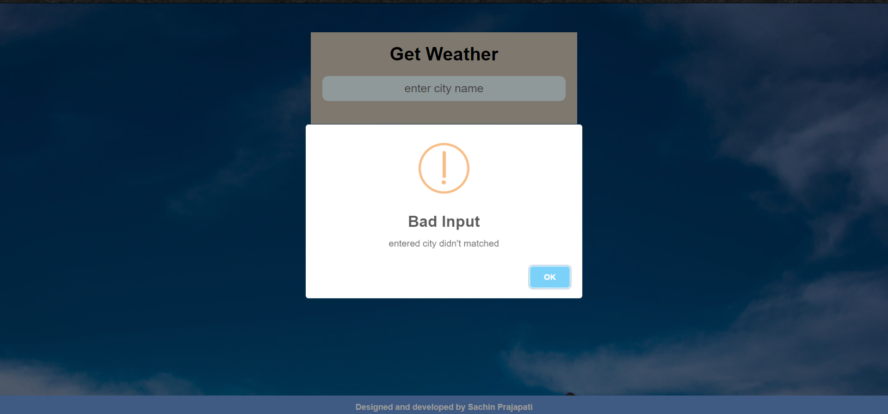

# Weather_App

## I used open weather API to fetch data 

### This  web project done in html,css ,js
 
### Features of the project.

* It provide dynamic weather data like temp, min max temp etc.
* Dynamic background images change according to weather status.
* Dynamic weather icon change according to weather status.
* It provide basic information like feels like temperature,humidity,pressure,wind speed.
* It will not accept empty input.
* It will give you  alert if city name not matched with api  data.
* A good  UX/UI. 

### Snapshot

* Default 

* When you entered any valid city
 

* When you did'nt entered anything 
 

* When entered city did'nt matched with data
 

